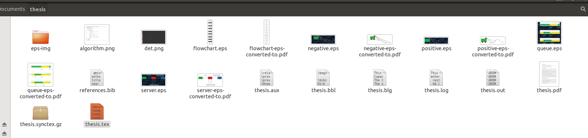
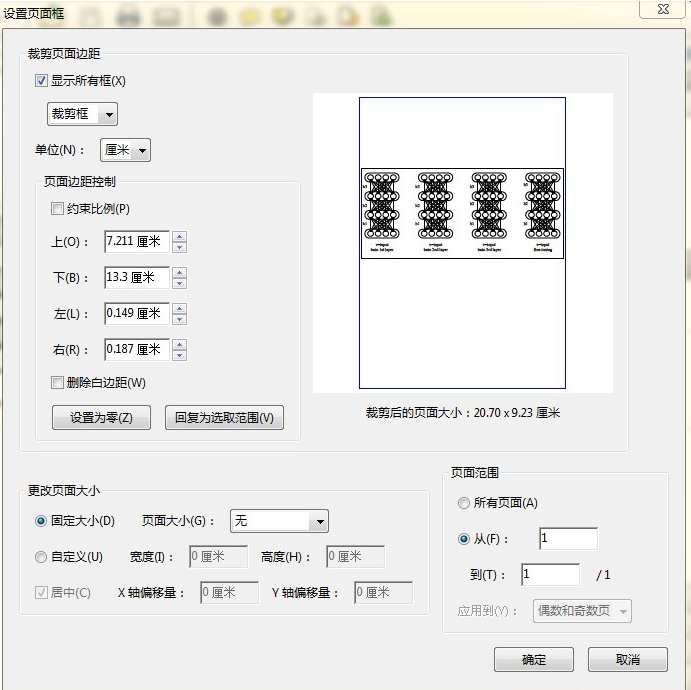
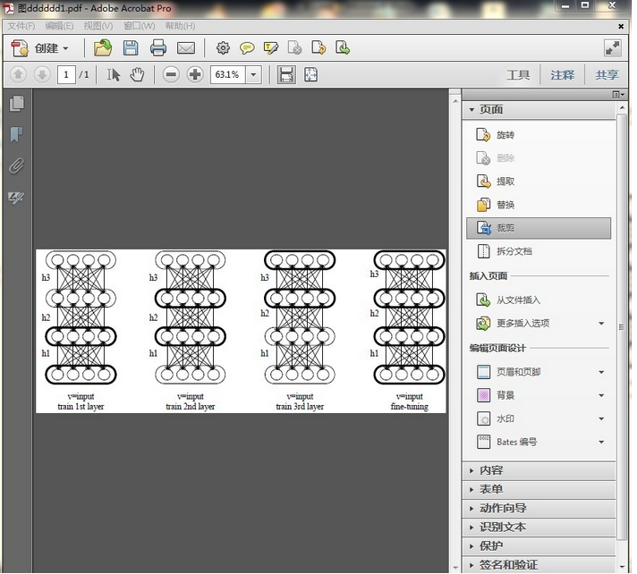
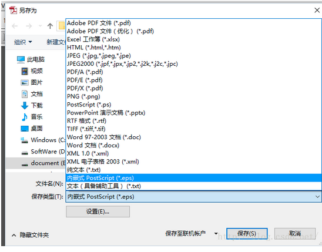

# insert image

## Prepare image
> first you have to prepare all the pictures you needed  and in put the images  in the same folder with your latex  files ,below is an example.





>以下的内容我不会翻译了，就用汉语吧

>下面介绍如何在LaTeX中插入.eps格式的图片
第一步：生成.eps格式的图片

>1、利用visio画图，另存为pdf格式的图片, 利用Adobe Acrobat裁边，使图片大小合适  另存为.eps格式，
使用Adobe Acrobat Pro（注意不是Adobe Reader而是Adobe Acrobat Pro）打开上面生成的pdf文件,点击右上角的工具->页面->裁剪->选中要裁剪的部分然后双击 出现设置页面如下图所示：




>选中删除白边距，然后点击确定就剪裁好了，如下图所示：




>按照下面的步骤执行：文件->另存为->更多选项->内嵌式PostScript 这样全部工作就完成了。因为Adobe Acrobat Pro的版本不同，可能步骤上有所差异，不过大体都差不多。希望对大家有帮助。




到现在为止已经准备好所有的eps 格式的文件了


## 在LaTeX 语句里面应该怎么写才能插入eps 格式的图片呢？

1、添加宏包


```
\usepackage{graphicx} %use graph format
\usepackage{epstopdf}

```
2、使用以下代码可以将图片加入进去：

```

\begin{figure}  
\centering  
\includegraphics[height=2cm,width=3cm]{exp.eps}  
\caption{yes}  
\label{1}  
\end{figure}

```

3.一个简单完整的示例代码如下
```

\documentclass[12pt]{article}  
\usepackage{graphicx} %use graph format  
\usepackage{epstopdf}  
\begin{document}  
\begin{figure}  
\centering  
\includegraphics[height=2cm,width=3cm]{exp.eps}  
\caption{yes}  
\label{1}  
\end{figure}  
\end{document}


```
4 此时可以编译查看效果了


## 在LaTeX 语句里面应该怎么写才能插入png 格式的图片呢？

```
\begin{figure}[H]
\centering
\includegraphics[width=0.75\textwidth]{features.png}
\caption{ SIFT Features in the Image}
\label{fig:features}
\end{figure}

```
## Cite

http://blog.csdn.net/qq_22812319/article/details/51889973

http://blog.csdn.net/kbawyg/article/details/8926113
