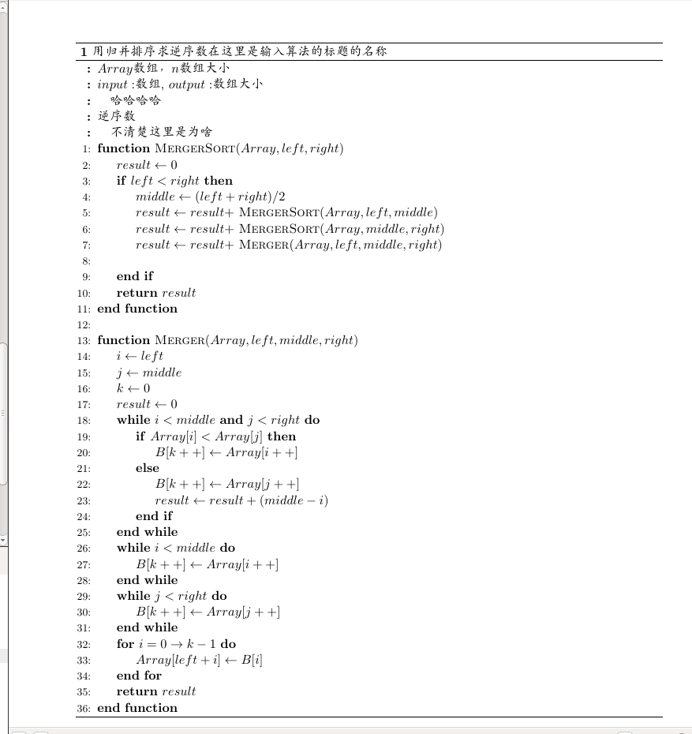
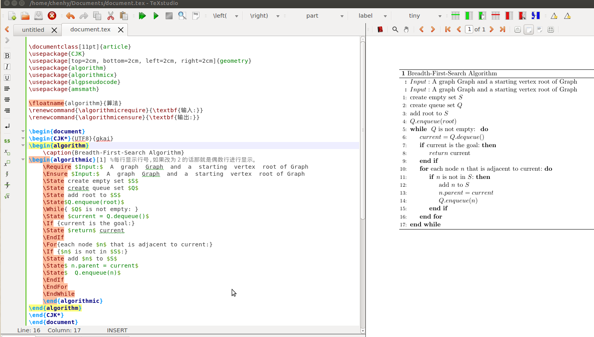

### latex 伪代码编写
```

\documentclass[11pt]{article}
\usepackage{CJK}
\usepackage[top=2cm, bottom=2cm, left=2cm, right=2cm]{geometry}
\usepackage{algorithm}
\usepackage{algorithmicx}
\usepackage{algpseudocode}
\usepackage{amsmath}

\floatname{algorithm}{算法}
\renewcommand{\algorithmicrequire}{\textbf{输入:}}
\renewcommand{\algorithmicensure}{\textbf{输出:}}

\begin{document}
	\begin{CJK*}{UTF8}{gkai}
		\begin{algorithm}
			\caption{用归并排序求逆序数在这里是输入算法的标题的名称}
			\begin{algorithmic}[1] %每行显示行号,如果改为２的话那就是偶数行进行显示。
				\Require $Array$数组，$n$数组大小
				\Require $input:$数组, $output:$数组大小
				\Require　
				\Ensure 逆序数
				\Ensure 　不清楚这里是为啥
				\Function {MergerSort}{$Array, left, right$}
				\State $result \gets 0$			
				\If {$left < right$}
				\State $middle \gets (left + right) / 2$
				\State $result \gets result +$ \Call{MergerSort}{$Array, left, middle$}
				\State $result \gets result +$ \Call{MergerSort}{$Array, middle, right$}
				\State $result \gets result +$ \Call{Merger}{$Array,left,middle,right$}
				\State
				\EndIf
				\State \Return{$result$}
				\EndFunction
				\State
				\Function{Merger}{$Array, left, middle, right$}
				\State $i\gets left$
				\State $j\gets middle$
				\State $k\gets 0$
				\State $result \gets 0$
				\While{$i<middle$ \textbf{and} $j<right$}
				\If{$Array[i]<Array[j]$}
				\State $B[k++]\gets Array[i++]$
				\Else
				\State $B[k++] \gets Array[j++]$
				\State $result \gets result + (middle - i)$
				\EndIf
				\EndWhile
				\While{$i<middle$}
				\State $B[k++] \gets Array[i++]$
				\EndWhile
				\While{$j<right$}
				\State $B[k++] \gets Array[j++]$
				\EndWhile
				\For{$i = 0 \to k-1$}
				\State $Array[left + i] \gets B[i]$
				\EndFor
				\State \Return{$result$}
				\EndFunction

			\end{algorithmic}
		\end{algorithm}
	\end{CJK*}
\end{document}
```
####result


### This is the first algorithm I have written in LATEX
```
\documentclass[11pt]{article}
\usepackage{CJK}
\usepackage[top=2cm, bottom=2cm, left=2cm, right=2cm]{geometry}
\usepackage{algorithm}
\usepackage{algorithmicx}
\usepackage{algpseudocode}
\usepackage{amsmath}

\floatname{algorithm}{算法}
\renewcommand{\algorithmicrequire}{\textbf{输入:}}
\renewcommand{\algorithmicensure}{\textbf{输出:}}

\begin{document}
\begin{CJK*}{UTF8}{gkai}
\begin{algorithm}
	\caption{Breadth-First-Search Algorithm}
\begin{algorithmic}[1] %每行显示行号,如果改为２的话那就是偶数行进行显示。
	\Require $Input:$  A  graph  Graph  and  a  starting  vertex  root of Graph
	\Ensure $Input:$  A  graph  Graph  and  a  starting  vertex  root of Graph
	\State create empty set $S$
	\State create queue set $Q$
	\State add root to $S$
	\State$Q.enqueue(root)$
	\While{ $Q$ is not empty: }
	\State $current = Q.dequeue()$
	\If {current is the goal:}
	\State $return$ current
	\EndIf
	\For{each node $n$ that is adjacent to current:}
	\If {$n$ is not in $S$:}
	\State add $n$ to $S$
	\State$ n.parent = current$
	\State$  Q.enqueue(n)$
	\EndIf
	\EndFor
	\EndWhile
	\end{algorithmic}
\end{algorithm}
\end{CJK*}
\end{document}
```

